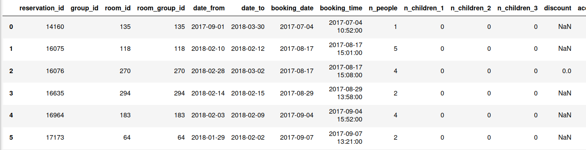
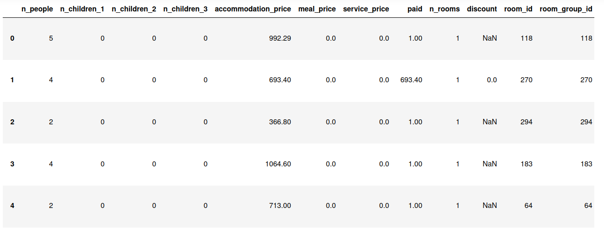
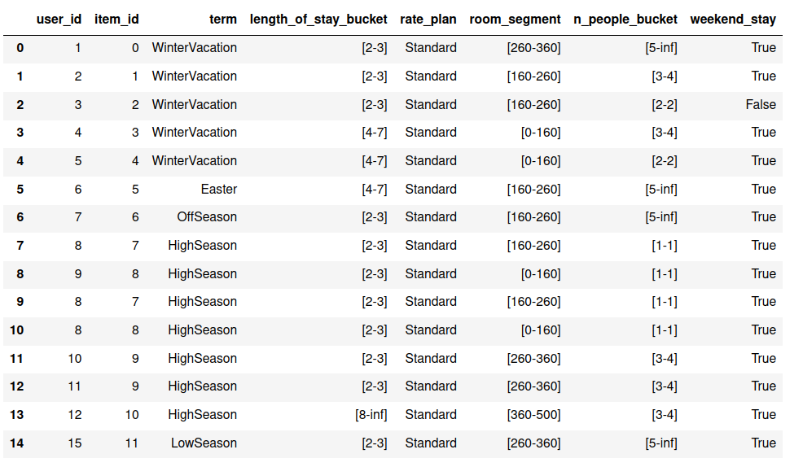
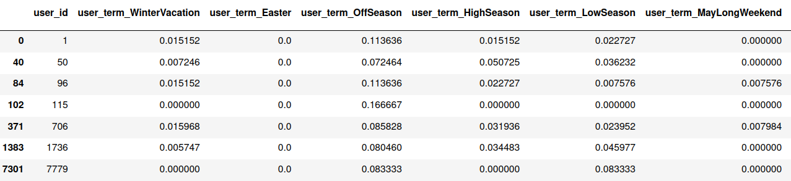
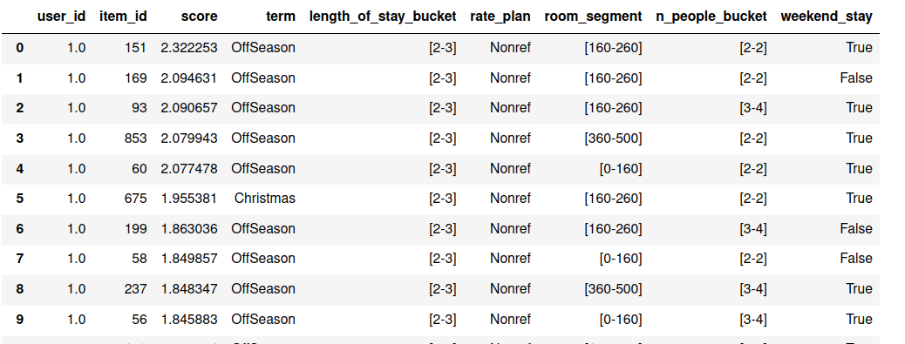
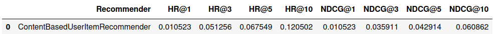

# Content Based Recommender

## Project description

The goal of this project was to:

1. Preprocess data
2. Create users and items features
3. Write fit method
4. Write recommend method
5. Tune several models end evaluate scores

## Data

The original dataset can be found in: /data/hotel_data/hotel_data_original.csv

Preprocessed data can be found in: /data/hotel_data/hotel_data_preprocessed.csv

Then the least important columns (e.g. email) are deleted and data is stored  in : /data/hotel_data/hotel_data_interactions_df.csv

## User and item features

User features are created by calculating the probability distribution of its values among all user's reservations. Data is split into one-hot encoding using pd.get_dummies() function. Later, data is grouped by user_id, then summed and finally normalized so that sum of features in every row is equal to 1. Item features are created in the same way.

I've also created user and item features using only one-hot encoding or calculating mean values for every column, but I was unsatisfied with the results.

## Fit method

In fit method five random negative interactions are generated for one positive interaction from dataset. Then negative interactions are merged with positive interactions and fitted into model. The whole process takes only about 8 seconds.

## Recommend method

In recommend method the Carthesian product of users from users_df and items from items_df is created. Then recommendations are generated using predict() or make_decision() function. Finally recommendations are sorted by score and returned.

## Tune models

Several models were tuned using Hyperopt. It turned out that the best model for my recommender was LogisticRegression. Although the @HR10 is not as good as AmazonRecommender, it is still quite a good score.

## Preparing your computer

1. Clone repository:

	<pre>git clone <i>https://github.com/jbiesek/ContentBasedRecommender.git</i></pre>

	Alternatively, open Git Bash (installed with Git), change the path to the folder where you want to have a local copy of the repository, execute the above command.

2. Prepare your conda environment:

	1. Open Anaconda Prompt as administrator.

	2. Make sure you're in the repository main folder. Run the following command:
			
			conda env create --name recommender -f environment.yml
		
		You may need to install a C++ compiler to install certain packages.

3. In Git Bash open the repository folder and activate just created environment with the following command:

		conda activate rs-class-env

4. You may need to type:

		pip install tqdm
		
		pip install future

5. In Git Bash type:

		jupyter notebook

	A new tab with Jupyter Notebook should open in your browser.

6. In Jupyter Notebook open project_1_recommender_and_evaluation.ipynb.

7. Click on the first cell and hit shift+enter. The first cell should get executed properly. Do the same for all other cells (you can continuously hit shift+enter until you execute all cells).

